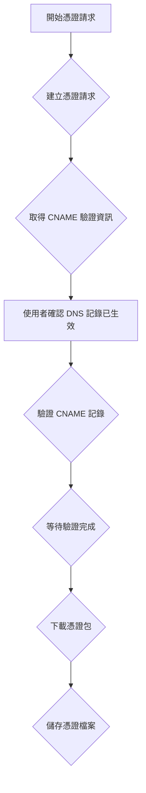

# ZeroSSL 憑證自動化腳本

此儲存庫包含 PowerShell 腳本，用於自動化從 ZeroSSL 獲取和管理 SSL 憑證的過程。

## 流程圖



## 腳本對照表

| 情境描述            | 腳本名稱                                  |
| ------------------- | ----------------------------------------- |
| 開始憑證請求        | `new-zerossl-certificate.ps1`             |
| 建立憑證請求        | `create-zerossl-certificate.ps1`          |
| 取得 CNAME 驗證資訊 | `get-zerossl-cname-challenge-info.ps1`    |
| 驗證 CNAME 記錄     | `verify-zerossl-cname-validation.ps1`     |
| 等待驗證完成        | `wait-zerossl-validation-completion.ps1`  |
| 下載憑證包          | `download-zerossl-certificate-bundle.ps1` |
| 儲存憑證檔案        | `save-zerossl-certificate-files.ps1`      |

## 腳本

- [`new-zerossl-certificate.ps1`](src/new-zerossl-certificate.ps1): 協調整個 ZeroSSL 憑證請求過程。它接受 API 金鑰、CSR 檔案路徑、網域清單和輸出路徑作為參數。它呼叫其他腳本來建立憑證、取得 CNAME 驗證資訊、驗證 CNAME 記錄、等待驗證完成、下載憑證包，並將憑證檔案儲存到指定的路徑。
- [`create-zerossl-certificate.ps1`](src/create-zerossl-certificate.ps1): 使用 ZeroSSL API 和提供的 CSR 檔案，為指定的網域建立新的憑證。它將憑證請求提交到 ZeroSSL API 並傳回憑證 ID。
- [`get-zerossl-cname-challenge-info.ps1`](src/get-zerossl-cname-challenge-info.ps1): 使用 ZeroSSL API 和提供的憑證 ID 檢索 CNAME 驗證資訊。它向 ZeroSSL API 發出請求並傳回每個網域的 CNAME 驗證資訊，包括目標主機和目標記錄。
- [`verify-zerossl-cname-validation.ps1`](src/verify-zerossl-cname-validation.ps1): 通知 ZeroSSL API 執行 CNAME 驗證。它接受 API 金鑰和憑證 ID 作為參數。它向 ZeroSSL API 發出請求，以使用 CNAME_CSR_HASH 方法驗證憑證。
- [`wait-zerossl-validation-completion.ps1`](src/wait-zerossl-validation-completion.ps1): 輪詢 ZeroSSL API，直到頒發憑證或達到最大重試次數。它接受 API 金鑰和憑證 ID 作為參數。它定期向 ZeroSSL API 發出請求，以檢查憑證狀態。
- [`download-zerossl-certificate-bundle.ps1`](src/download-zerossl-certificate-bundle.ps1): 使用 ZeroSSL API 和提供的憑證 ID 下載憑證包。它向 ZeroSSL API 發出請求並傳回憑證包的內容。
- [`save-zerossl-certificate-files.ps1`](src/save-zerossl-certificate-files.ps1): 將憑證檔案儲存到指定的路徑。它接受憑證資料（包含憑證和 CA 鏈）和輸出路徑作為參數。它建立輸出資料夾（如果不存在）並將主憑證和 CA 鏈儲存為 `.crt` 檔案。

## 如何建立 CSR 檔案？

1. 安裝 OpenSSL。
2. 執行以下指令，它應該會要你打一些資訊，視你情境去輸入。

   ```powershell
   openssl req -nodes -newkey rsa:2048 -sha256 -keyout example.key -out example.csr
   ```

3. 產生出來的 `example.key` 請保管好。
4. 產生出來的 `example.csr` 拿來作為 CSR 檔案輸入。

## 執行範例

```powershell
.\new-zerossl-certificate.ps1 -ApiKey <key> -CsrPath <csrpath> -Domains @("example.com") -OutputPath ".\cert"
```

## 驗證支援情境

- [ ] Email 驗證
- [x] CNAME 驗證
- [ ] File 上傳驗證

> 目前僅支援 CNAME 驗證。
